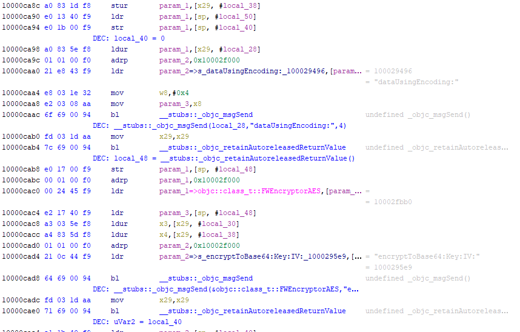
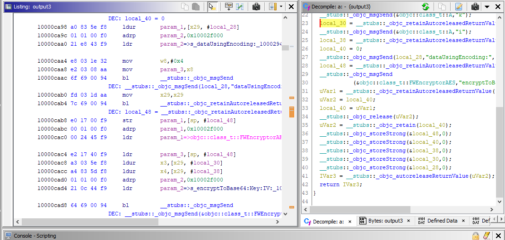

# ListingLover - Add the pseudocode as comment to the disassembly listing

ListingLover is a simple Ghidra script that copies pseudocode to disassembly listing as comments, like IDA Pro feature reachable from the '/' key. Unlike IDA, pseudocode is inserted as POST comment and follows related disassembly instructions. POST comments are perfect for this purpose, because by default they are shown in the disassembly listing and not in the decompiler pane, avoiding filling this pane with duplicate data. While IDA Pro instantly adds the pseudocode to the disassembly listing (probably because the pseudocode data is already associated to the disassembly listing internally), in Ghidra I have to scroll all disassembly, decompile every function and add all needed comments to the disassembly listing. These operations may require a lot of time, especially when reversing huge binaries. Based on some tests I did, ListingLover requires an amount of time comparable to that spent during initial analysis. The plugin can be used also to remove those comments, once added, but it is advisable to hide POST comments instead of removing ListingLover comments, in order to avoid wasting time.

Tested with Ghidra v9.2.3.

## Usage

### GUI mode
1.	Auto analyze your target binary with the default analyzers (at least)
2.	Copy the script into your ghidra_scripts directory
3.	Open the Script Manager in Ghidra and run the script
4.	You can also run it via the Tools > ListingLover menu or the shurtcut "/"
 
### Headless mode
1.	Launch analyzeHeadless with -postScript ListingLover.java

## Author
- Federico Dotta -  Principal Security Analyst at HN Security

## References
- [ListingLover – Add pseudo-code to Ghidra disassembly](https://security.humanativaspa.it/listinglover-add-pseudocode-to-ghidra-disassembly/)

## Screenshots
- Disassembly listing with pseudocode as POST comment

- Listing pane with comments and pseucode pane

